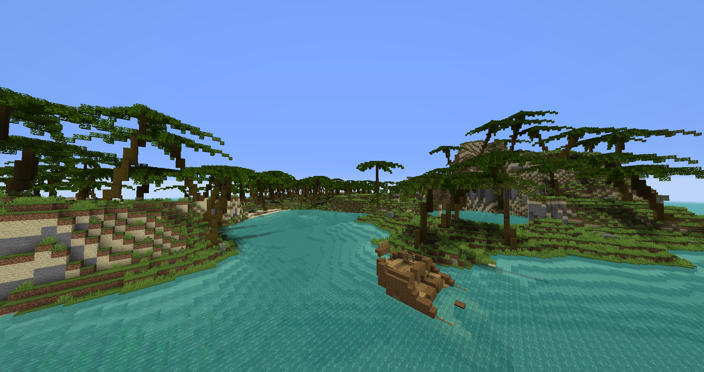
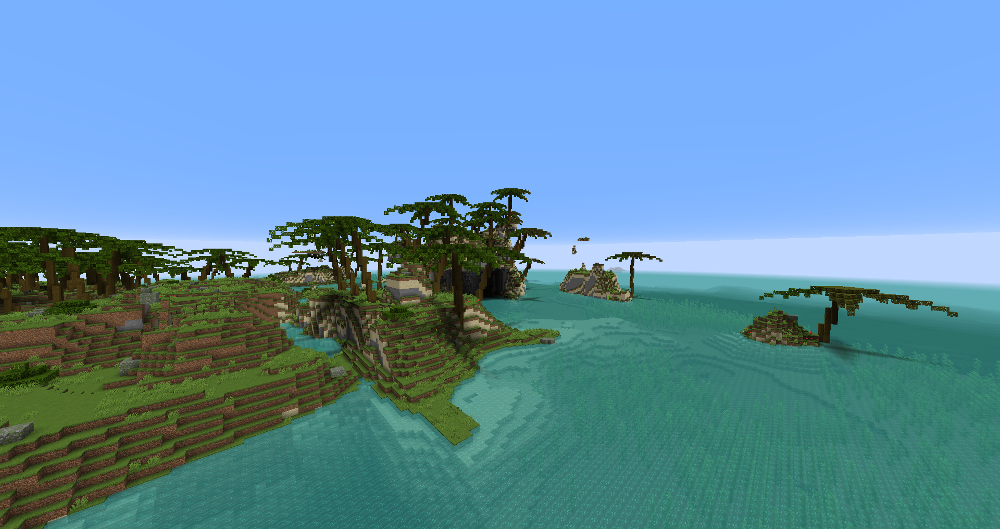
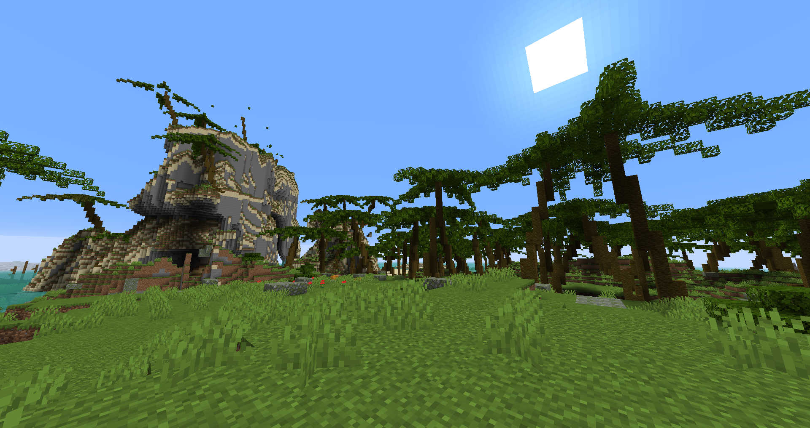
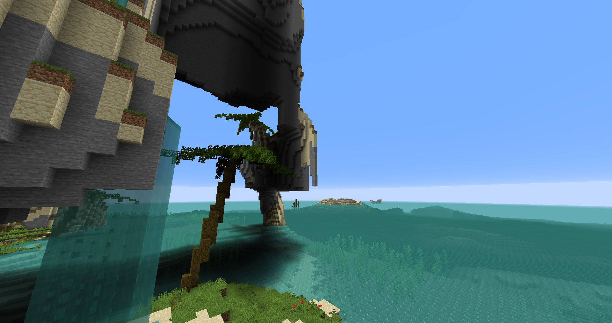

# Aquatica

---

*Aquatica* is a modern tropical adventure inspired by mods like [Tropicraft](https://www.curseforge.com/minecraft/mc-mods/tropicraft). 
Unlike previous takes on this idea, Aquatica provides a new twist: you are stranded on an Aquatic
island, and have to survive in this environment from the very start. Scavenge for resources, fight off pirates,
scuba-dive for goodies, and build your civilization in this world-type tropical mod.

---

### Showcase

### License

Aquatica is available under the MIT license. 
You are free to use the code, art, and techniques in this repository inside other projects,
and are also free to distribute this mod in modpacks.